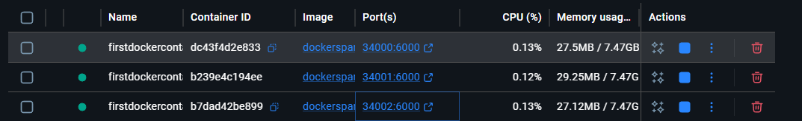
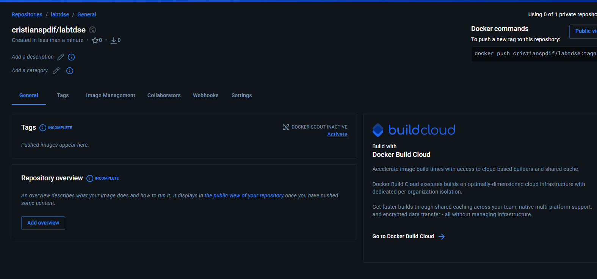
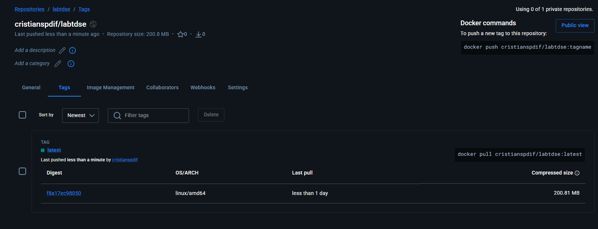
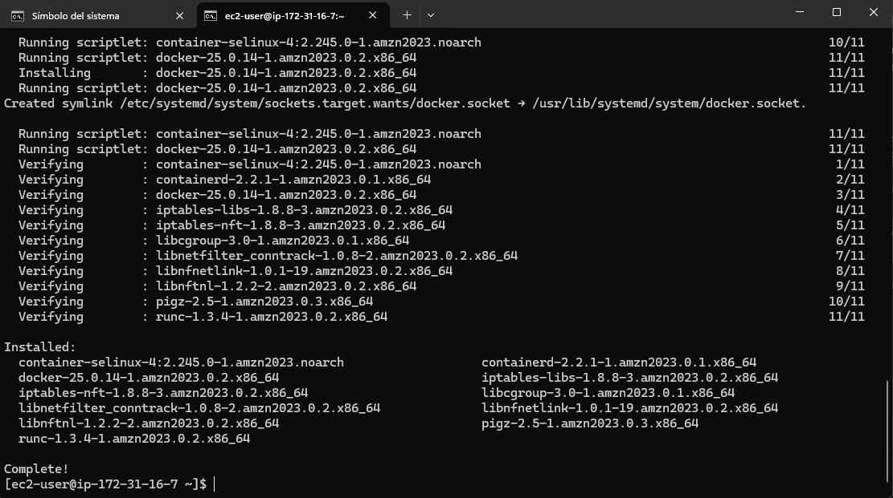
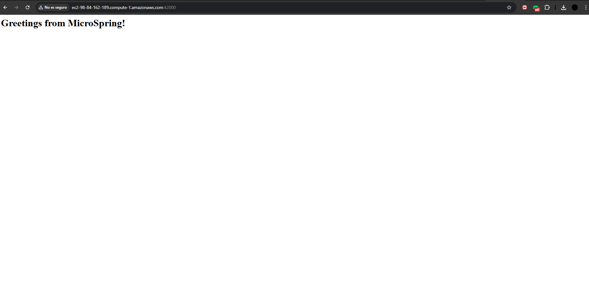
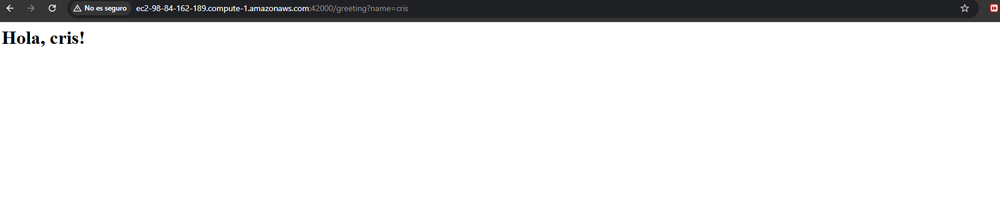
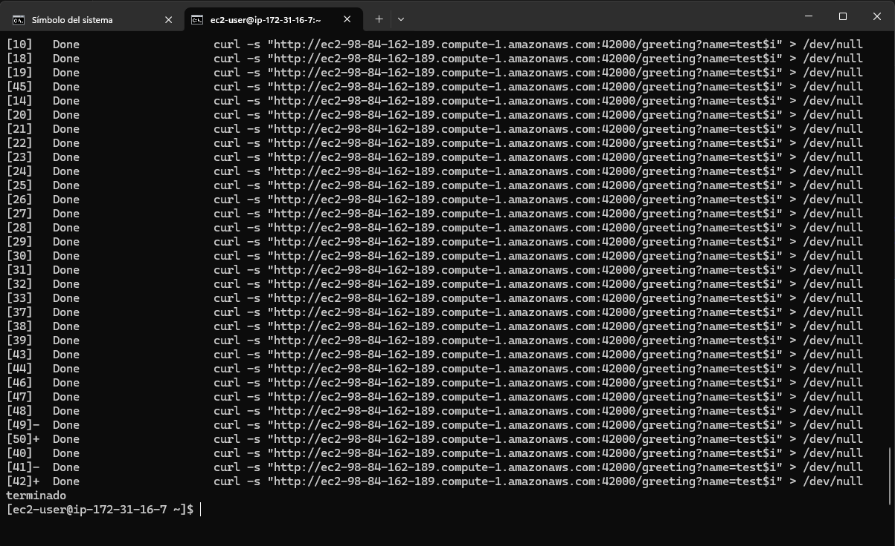
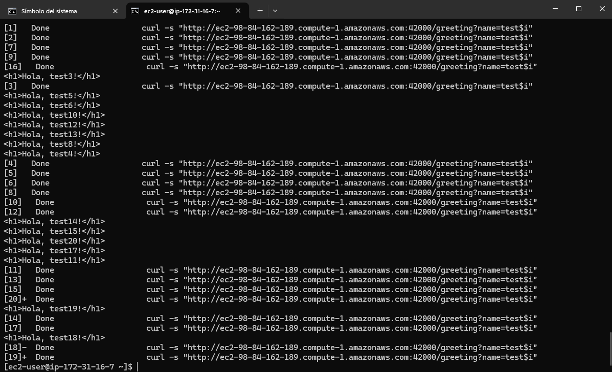
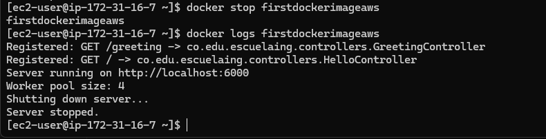

# MicroFramework Java

Este proyecto implementa un microframework HTTP en Java sin usar Spring. El framework usa sockets, reflexión y anotaciones personalizadas para descubrir controladores, registrar rutas GET y resolver parámetros de consulta. Además, el servidor fue ajustado para atender solicitudes concurrentes mediante un pool de hilos y para apagarse de manera elegante cuando el proceso recibe una señal de terminación.

## Resumen del proyecto

El objetivo del proyecto es construir un servidor HTTP ligero inspirado en algunos conceptos de Spring Boot, pero implementado únicamente con Java estándar. El framework permite:

- Definir controladores con `@RestController`.
- Registrar endpoints GET con `@GetMapping`.
- Resolver parámetros de consulta con `@RequestParam`.
- Descubrir controladores automáticamente recorriendo el classpath.
- Atender múltiples solicitudes de manera concurrente.
- Cerrar el servidor de forma ordenada sin cortar abruptamente el proceso.

## Arquitectura

La arquitectura está dividida en cuatro bloques principales:

1. `MicroSpringBoot`: punto de entrada de la aplicación. Crea el servidor, resuelve el puerto desde la variable de entorno `PORT`, escanea el classpath y registra los controladores encontrados.
2. `annotations`: conjunto de anotaciones personalizadas usadas para marcar clases y métodos del framework.
3. `server`: contiene la implementación del servidor HTTP, el enrutamiento y el procesamiento de solicitudes.
4. `controllers`: contiene los controladores de ejemplo expuestos por el framework.

Flujo general de ejecución:

1. La clase principal crea una instancia de `HttpServer`.
2. El framework busca clases anotadas con `@RestController`.
3. Los métodos anotados con `@GetMapping` se registran como rutas.
4. `HttpServer` acepta conexiones entrantes y delega cada request a un hilo del pool.
5. `RequestHandler` interpreta la petición HTTP, resuelve parámetros y ejecuta el método del controlador por reflexión.
6. Cuando el proceso termina, el shutdown hook cierra el socket del servidor y espera a que finalicen los hilos activos.

## Diseño de clases

### `MicroSpringBoot`

- Es la clase principal del proyecto.
- Lee el puerto desde la variable de entorno `PORT` y usa `8080` como valor por defecto.
- Escanea el classpath para encontrar clases compiladas.
- Registra automáticamente controladores y endpoints en el servidor.

### `HttpServer`

- Administra el `ServerSocket` principal.
- Mantiene el mapa de rutas y controladores usando `ConcurrentHashMap`.
- Usa `ExecutorService` con un pool fijo de hilos para soportar concurrencia.
- Implementa apagado elegante mediante `shutdown()`, `awaitTermination(...)` y un `shutdown hook`.

### `RequestHandler`

- Atiende una solicitud HTTP individual.
- Lee la línea inicial del request.
- Identifica la ruta y los query params.
- Invoca el método del controlador usando reflexión.
- Construye y devuelve la respuesta HTTP.

### Anotaciones personalizadas

- `@RestController`: marca una clase como controlador.
- `@GetMapping`: asocia un método a una ruta GET.
- `@RequestParam`: enlaza parámetros del query string con argumentos del método.

### Controladores de ejemplo

- `HelloController`: expone la ruta `/`.
- `GreetingController`: expone la ruta `/greeting?name=...`.

## Estructura del proyecto

```text
src/main/java/co/edu/escuelaing/
|- MicroSpringBoot.java
|- annotations/
|  |- GetMapping.java
|  |- RequestParam.java
|  |- RestController.java
|- controllers/
|  |- GreetingController.java
|  |- HelloController.java
|- server/
	|- HttpServer.java
	|- RequestHandler.java
Dockerfile
docker-compose.yml
pom.xml
README.md
images/
```

## Requisitos

- Java 21
- Maven 3.x
- Docker
- Docker Compose

## Cómo compilar y ejecutar localmente

Compilar el proyecto:

```bash
mvn clean package
```

Ejecutar la aplicación localmente:

```bash
java -cp target/classes co.edu.escuelaing.MicroSpringBoot
```

Probar endpoints:

```bash
curl "http://localhost:8080/"
curl "http://localhost:8080/greeting"
curl "http://localhost:8080/greeting?name=Cristian"
```

## Endpoints disponibles

- `GET /` retorna `"<h1>Greetings from MicroSpring!</h1>"`
- `GET /greeting?name=TuNombre` retorna `"<h1>Hola, TuNombre!</h1>"`
- Si no se envía `name`, el valor por defecto es `World`

## Concurrencia y apagado elegante

El servidor cumple el requerimiento de concurrencia y apagado elegante con la siguiente estrategia:

- Usa `ExecutorService` para procesar múltiples requests en paralelo.
- Usa `ConcurrentHashMap` para almacenar rutas y controladores de forma segura en entornos concurrentes.
- Usa `AtomicBoolean` para controlar el ciclo de vida del servidor.
- Registra un `shutdown hook` con `Runtime.getRuntime().addShutdownHook(...)`.
- Espera hasta 30 segundos a que terminen las tareas activas antes de forzar el cierre.

## Generación de imagen Docker

Construir la imagen localmente:

```bash
docker build -t dockersparkprimer .
```

Ejecutar el contenedor exponiendo el puerto 6000 interno en el puerto 34000 local:

```bash
docker run -d -p 34000:6000 --name firstdockercontainer dockersparkprimer
```

Probar el despliegue:

```bash
curl "http://localhost:34000/"
curl "http://localhost:34000/greeting?name=Cristian"
```

## Despliegue con Docker Compose

Levantar los servicios definidos en `docker-compose.yml`:

```bash
docker compose up --build -d
```

Con la configuración actual, la aplicación queda publicada en el puerto `8087` del host:

```bash
http://localhost:8087/
http://localhost:8087/greeting?name=Cristian
```

## Despliegue en AWS EC2

Ejemplo de ejecución de la imagen publicada en Docker Hub:

```bash
docker run -d -p 42000:6000 --name firstdockerimageaws cristianspdif/labtdse
```

Para acceder desde Internet, se debe abrir el puerto `42000/TCP` en el Security Group de la instancia EC2.

Pruebas sobre la instancia:

```bash
curl "http://IP_PUBLICA_EC2:42000/"
curl "http://IP_PUBLICA_EC2:42000/greeting?name=Cristian"
```

## Evidencias

### Construcción y ejecución local








### Despliegue y validación








### Pruebas de concurrencia

Las siguientes capturas muestran las pruebas de concurrencia realizadas sobre el despliegue:





### Prueba de apagado elegante

La siguiente captura muestra la evidencia del apagado elegante del servidor:



### Video de demostración

El siguiente video muestra el despliegue completo del microframework en AWS EC2 con las pruebas de funcionalidad, concurrencia y apagado elegante:

<video width="640" height="480" controls>
  <source src="images/videotdsemcspring.mp4" type="video/mp4">
  Tu navegador no soporta video.
</video>
